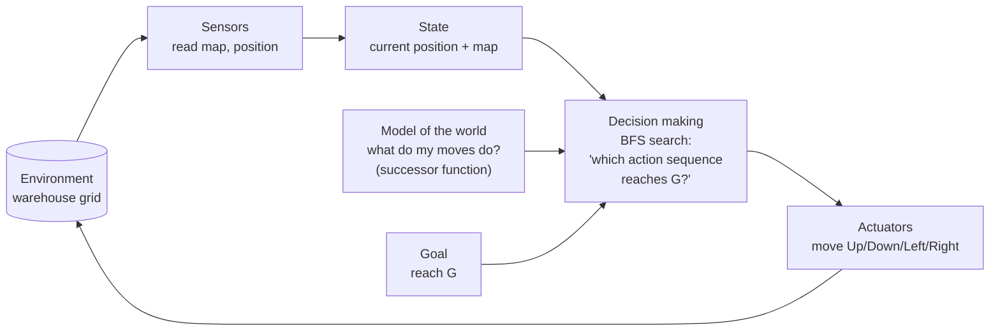

# Goal-Based Agent for Warehouse Navigation

Laboratory exercise: constructing a goal-based agent with the help of a Large Language Model (Claude).

## Files

| File | Purpose |
|---|---|
| `warehouse_agent.py` | The agent, environment, BFS and A* search |
| `test_warehouse_agent.py` | Unit tests (valid path, no-path case, BFS vs A*) |
| `README.md` | Task 1–3 answers, design, results |

## How to run

```bash
python warehouse_agent.py              # Breadth-First Search (default)
python warehouse_agent.py --algo astar # A* with Manhattan-distance heuristic
python -m unittest -v                  # run the tests
```

Requires Python 3.x only (standard library, no installs).

## Result

```
#####################
#S***.#************G#
#.##****##########..#
#....##.............#
#.######.###.#.###..#
#........#..........#
#####################
```

* Path length: **20 moves** (shortest possible)
* Nodes expanded: 59 (BFS) vs 23 (A*), both find a 20-move path
* Action sequence (BFS): Right ×3, Down, Right ×3, Up, Right ×12

---

## Task 1 – Understanding the Problem

**1. What is the environment?**
A 7 × 21 grid warehouse. Cells are free space (`.`), obstacles/shelving (`#`), the start (`S`) or the goal (`G`). It is fully observable (the whole map is known), static (nothing moves), deterministic (a move always succeeds if the target cell is free), discrete and single-agent.

**2. What is the goal of the agent?**
To move the vehicle from `S` (row 1, col 1) to `G` (row 1, col 19) along a collision-free path, ideally the shortest.

**3. What actions are available?**
Up, Down, Left, Right. Each moves one grid square and costs 1. A move into a `#` or outside the grid is illegal.

**4. What information must the agent maintain?**
* its current position (the state);
* the goal position;
* the map (to know which moves are legal);
* the search bookkeeping: a frontier of positions still to explore, a set of visited positions (prevents loops), and a record of how each position was reached (to rebuild the path).

**5. Why goal-based rather than simple reflex?**
A simple reflex agent maps the current percept directly to an action ("if wall on right, turn left") with no notion of where it is trying to go. It can get trapped in dead ends or loops, because the map contains dead ends (e.g. the left-hand corridors). A goal-based agent has an explicit goal and considers the *future consequences* of actions: it searches through sequences of moves and picks the one that reaches the goal.

**Think About It – a warehouse twice as large**
BFS would still be *correct*, but its cost grows with the number of cells (time and memory are O(cells)). Doubling each dimension gives about 4× as many cells. Difficulties that could arise:
* BFS explores in all directions equally, so memory (the frontier) and time grow quickly. **A\*** with a heuristic (Manhattan distance) or bidirectional search scales better.
* Real warehouses are dynamic: other vehicles, people and moved shelving mean the plan must be recomputed (replanning, e.g. D\* Lite).
* Multiple vehicles need coordination to avoid collisions and deadlock.
* Vehicle turning radius, speed and different move costs mean uniform-cost grids are no longer realistic.
* The map may only be partially observable, requiring the agent to maintain a belief about the environment.

---

## Task 2 – Designing the Agent

| Component | Design |
|---|---|
| Environment | 7 × 21 grid; `#` obstacles; static, deterministic, fully observable |
| Current state | Agent's position `(row, col)`, initially `S = (1, 1)` |
| Goal | Position `G = (1, 19)`; goal test: `state == goal` |
| Actions | Up, Down, Left, Right (one square, cost 1) |
| Decision-making component | Search (BFS) over the state space; outputs an action sequence (plan) |

### Block diagram (goal-based architecture)



(GitHub renders this diagram automatically. For your lab report, you can also redraw it by hand or in draw.io: boxes for Sensors → State → Decision Making → Actuators → Environment, with Goal and World Model feeding into Decision Making.)

**How the components interact:** the agent senses the map and its position and updates its state. Using its model of how moves change the state (`successors()`) and its goal, the decision component searches for a sequence of actions ending at `G`. The actuators then execute the actions, changing the vehicle's position in the environment.

---

## Task 3 – Prompt Engineering

**Prompt used**

> Write a well-documented Python program implementing a goal-based agent for the warehouse navigation problem shown above. The program should: represent the warehouse as a two-dimensional grid; determine a collision-free path from S to G; avoid all obstacles; print either the path found or a suitable message if no path exists; explain the search algorithm that has been chosen and why it is appropriate.

(Followed by the map and the movement rules.)

**1. Did the LLM generate a working program on the first attempt?**
Yes. The program ran without errors and produced a valid 20-move path. The only issues found were cosmetic (an awkwardly written print statement for the coordinates and a stray trailing space in the output), fixed in a follow-up edit. *(If your own LLM's first attempt failed, describe the error and how you fixed it here instead.)*

**2. If not, how can you improve your prompt?**
Be specific about: the map as literal text, the exact allowed moves, the required output format (path as coordinates, map with `*` drawn on it), a code structure (separate `Warehouse` and `Agent` classes), the "no path" behaviour, and a request for tests. Paste any error message back into the LLM verbatim when asking for a fix.

**3. What search algorithm did the LLM choose?**
**Breadth-First Search (BFS)**, with A* provided as an optional alternative.

**4. Why was this algorithm selected?**
* All moves cost the same (1), so BFS is guaranteed to find the **shortest** path.
* It is **complete**: if a path exists it will find it, and if none exists it terminates and reports so.
* The grid is small, so BFS's memory use is not a concern.
* It is simple and easy to explain and verify.

### Testing and validation
Beyond running the program, the tests check that: the path only uses legal one-square moves; no step enters a `#` cell; the path ends at `G`; BFS and A* produce the same optimal length; an unreachable goal returns "no path" instead of crashing; and a map missing `S` raises an error.

### Strengths and limitations of LLM-assisted development (Learning Objective 5)
* **Strengths:** fast, well-structured and documented code; suggests alternatives (A*); good at boilerplate and tests.
* **Limitations:** can produce confident code that is subtly wrong, so it must be run and tested; quality depends on how precise the prompt is; the human must still define the problem, check edge cases and understand the algorithm.
